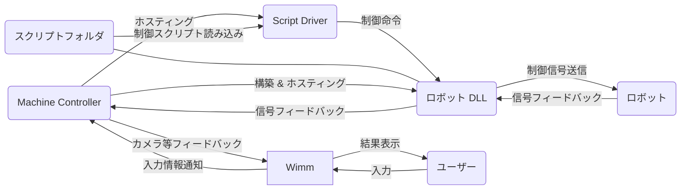

# ロボット抽象化統一制御ソフトウェア Wimm

神戸大学 六甲おろしで開発された複数種類のロボットを統一的に操作することを目的としたソフトウェアです。  
MVVMパターンに基づくUIとモデルの分離、ロボットの定義、コントローラーなどの入力に対するロボットの制御、ロボットから送信された情報の処理と描画とその結果のフィードバックを別のモジュールに分離を行い各ロボットに対するある程度具象的な制御を維持しつつ抽象化を実現します。

*Wimm*は .NET と WPF をベースフレームワークに用いて実装されます。

## ロボット抽象化の概要
このソフトウェアではロボットの制御を切り離して外部のDLLファイルとして定義し、起動時にこのファイルを動的に呼び出して制御モデルを構築します。  
DLLファイルは **ロボットにできること** を実装し外部に公開します。ロボットの操作には関与しません。
DLLファイルが公開した機能を呼び出すのはスクリプトが行います。*Wimm*はスクリプト言語として[NeoLua](https://github.com/neolithos/neolua)を利用します。

Wimm制御の図

## 目次
- [2-ロボットの定義](2-ロボットの定義.md)